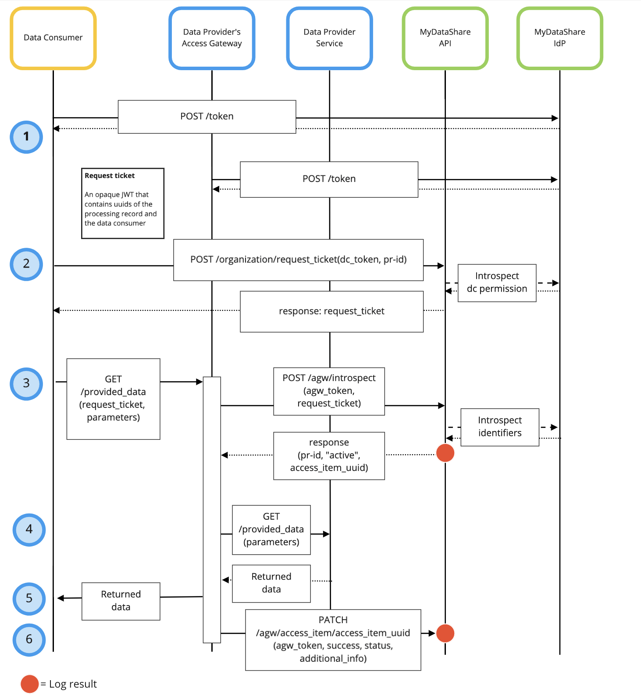

# MyDataShare Access Gateway

Access Gateway (hereafter, for brevity: AGW) is a general purpose extendable API gateway developed originally for MyDataShare to shield and protect the data providing services but is not limited to be used within the MyDataShare ecosystem. However, most of this document focuses on using MyDataShare Access Gateway as part of MyDataShare ecosystem.

The main feature of AGW is to help ecosystem members to easily protect their data provider services. AGW acts as a shield atop the data provider service and introspects inbound requests for validity.

Please refer to ([MyDataShare Developer Guide](https://kampanja.vastuugroup.fi/hubfs/developer-guide.pdf) and [MyDataShare API Reference](https://app.swaggerhub.com/apis/MyDataShare2/MyDataShare/)) for additional information about the product.

## Hosting alternatives

AGW can be hosted in two modes.

- A customer may utilize an operator-provided AGW instance (SaaS-licensing).
- A customer may elect to host their own AGW instance (self-hosting).

Additionally, during development and configuration of AGW an instance of it is trivially hostable on developer's own workstation.

A developer may use it with an appropriate MyDataShare environment (beta or staging), or alternatively use it without any operator-provided tooling at all.

## Getting started

Developers can experiment with an entirely independent instance of an AGW (that does not validate requests using a MyData operator).

Docker-compose is used to manage the execution environment.

First, create an `.env` file. You can copy the file `.env.example` to get a starting point with possible environment variables.

Both the AGW and the data provider are started with the following command:

```
docker-compose up mock_dp agw
```

## Deployment

However, in order to utilize an AGW with an operator backend (i.e. MDS), the operator administrator (i.e. using the admin-scope) is needed to perform the following tasks:

- Create the AGW client in the identity provider.
- Create the client_id object.
- Create the access_gateway object.
- Link the access_gateway object to the data provider (using the identifier provided by the developer).

Eventually these operations shall be made available to clients that have the permission to operate with the organization-scope.

The access gateways configured in MDS are available with the following request:

```
curl -X POST -H "authorization: Bearer $TOKEN" -H "Content-Type:application/json" $ORG_URL/access_gateways
```

With the following response:

```
{
    "access_gateways": {
        "56c0b229-c1ce-421f-8701-5353f93d7633": {
            "description": "Example access gateway for experimentation",
            "name": "Example AGW",
            "url_group_id": 6676,
            "suppressed_fields": [
                "data_providers.uuid",
                "client_ids.uuid"
            ],  
            "updated": "2021-04-12T14:24:35.318690+00:00",
            "deleted": false,
            "organization_uuid": "d3943c01-bb57-41ad-8877-52d32097e8de",
            "created": "2021-04-12T14:24:35.318686+00:00",
            "uuid": "56c0b229-c1ce-421f-8701-5353f93d7633"
        },
```

## Overview of using the Access Gateway

As noted in the introduction, the primary use case for AGW is to ambiently validate inbound data requests and pass only valid ones to the data provider service.

Thus, an existing data provider can be mydata-ized by covering it with an AGW instance.

This essentially means that ultimately the **data provider can be utilized as-is, without any changes to it**.

AGW promotes **configuration over code**, and thus request management within AGW can be done by tweaking well-defined configuration files and chaining operations.

The configuration files are in JSON-format and covered in detail below.

The utilization of the AGW generates log entries (for introspection result and for the actual retrieval of data) that are visible to the data subject and the data provider's organization using the API provided by the MDS backend (each long entry is available as an access_item object). These log entries are not available if the AGW instance does not utilize a MDS backend for introspection.

### Introspection flow

The introspection flow of request is as shown in the simplified sequence diagram:



The sequence consists of the following steps:

1. Both the data consumer and access gateway obtain the necessary credentials (access tokens) from the MDS' Identity Provider.
2. Data consumer obtains a request_ticket with which it shall perform the actual data request. If a request_ticket cannot be granted (e.g. the consumer has no permission to the processing record), the sequence ends here.
3. Data consumer performs the data request, providing both the request_ticket as well as all the parameters needed for the actual data request.
	- AGW introspects the request_ticket using MDS backend.
	- MDS backend generates a request log entry for the introspection result (whether the processing record is valid and whether the data subject has granted the required permission).
	- If the introspection returns anything else than a granted permission, the sequence ends here.
4. AGW executes the request to the data provider on behalf of the data consumer.
   - AGW generates the request to the data provider
   - AGW executes the request
5. AGW evaluates the data provider response and responds to the data consumer
   - AGW parses the data provider response
   - AGW generates the response to the data consumer
   - AGW patches the log entry in the MDS's log to contain the status the the response
   - AGW sends the response to data consumer
6. AGW updates the event log with the result of the data request

AGW can use multiple data providers as well as multiple requests, and aggregate the data consumer response from their responses.

### Access gateway configuration

For each inbound request that the access gateway shall be able to serve, that inbound request must be configured.

This configuration is performed by creating a Gateway definition file in the `gateways` directory.

Thus the AGW consists of one or more gateways, each of which consists of the parts listed below.

```
{
    "route": {
        "path": "/foo/simple/<baz>",
        "method": "POST",
        "plugins": [
            { "plugin": "mop_request_ticket_validation" }
        ]
    },
    "requests": [
        {
            "url": "http://dataprovider.example.com/foo?item=0&limit=100",
            "method": "POST",
            "headers": {
                "version": "bar ${route.headers.Version}",
                "omit": "lol ${route.query.except[0]}"
            },
            "json": {
                "request_list": "${route.baz}"
            }
        },
        {
            "url": "http://dataprovider.example.com/bar?count=${requests[0].response.json.count}",
            "method": "GET",
            "headers": {
                "locale": "bar ${route.headers.Locale}"
            }
        }
    ],
    "response": {
        "status": 200,
        "headers": {
            "content_type": "application/json"
        },
        "json": {
            "count": "bar ${requests[0].response.json.count}",
            "allow": "${requests[0].response.headers.Access-Control-Allow-Headers}",
            "status": "resp1 ${requests[1].response.json.status}"
        }
    },
    "after_hooks": [
        { "after_hook": "patch_mop_access_item" }
    ]
}
```

Each request consists of four separate parts:

1. The `route` defines the endpoint available for data consumers (as "inbound request")
    - The provided url,
    - The provided REST method,
    - The following elements are available from the inbound request
      - HTTP headers
      - The query parameters in the request (available as a dictionary of arrays)
      - The dynamic (i.e. path) parameter (available as a dictionary, see [https://bottlepy.org/docs/dev/tutorial.html#dynamic-routes](Bottle documentation) for details)
      - The contents of the request body, can be rendered in either
        - json (as JSON)
        - data (as application/x-www-form-urlencoded)
        - text (as an uninterpreted string)      
    - A route definition may utilize **plugins** to ensure that only valid requests are performed on the data providers. The extra-dictionary of the route provides storage for the state of a plugin.
    - Typically the `mop_request_ticket_validation` is performed at this stage to ensure that the request is valid (as described under introspection flow, above).
2. The `requests` defines the set of provider requests to be performed by the AGW to harvest the data for the response.
    - The set may be empty (in which case the response is built without accessing any data).
    - Each provider request may be built by using direct references to inbound request
      - Parameters
      - HTTP headers,
      - The contents of the request body, can be rendered in either
        - json (as JSON)
        - data (as application/x-www-form-urlencoded)
        - text (as an uninterpreted string)
    - Additionally a provider request may be generated by using **builders**: copy, set and delete primitives are used to manage the elements in the provider request.
    - Upon completion of a provider request, **processors** are run on the provider responses. Currently a processor for converting from XML to JSON format is available.
    - The provider requests are serialized, i.e. they are performed one after another (note: this default behaviour will be complemented by parallelism in an upcoming release).
    - In addition to using the inbound request to build provider requests, they can utilize the provider responses of provider requests performed.
3. The `response` defines how to generate the response to be sent to the data consumer after all the provider requests have been performed and their responses run through the processors.
    - The response status, headers and body may be set by AGW.
    - The response may be built using direct references to parameters, headers or content of inbound requests and provider responses as above.
    - The response body can be rendered in either
      - json (as JSON)
      - data (as application/x-www-form-urlencoded)
      - text (as an uninterpreted string)    
    - Additionally the response may be generated using **generators**: copy, set and delete primitives are used to manage the elements in the response.
4. The `after_hooks` defines the actions performed after the response has been generated.
    - after_hooks is an optional part.
    - Typically this consists of updating the request-log entry that is generated at `mop_request_ticket_validation` with the result of the requests by using  `patch_mop_access_item`.

Entries in path or query parameters of the request, in the headers of the request or in the body (whether in json, form-data or plain text) of the request can be accessed through the `route`-object as shown in the example above.

The same access methods are applicable to parsing responses to requests performed to data providers. The individual responses are accessed by index in the `requests`-array.

As noted above, each step may involve the execution of one or more tools (the default set of which is available in sub-directories of `agw`).

**Note**: The requests must not use any other person-specific identifiers than one that the permission request targets. This required is to avoid a situation where an introspection of a request ticket allows the AGW to proceed with the provider request, which then targets the data of a completely different subject.

#### Primitives

Builders and generators may utilize copy, set and delete primitives to create content into the provider requests or the response:
  - copy duplicates the named entity from a dictionary or array into the target.
  - set creates a new named entity into the target dictionary.
  - delete deletes the named entity from the target dictionary.

```
...
{ "builder": "copy", "from": "route.headers", "to": "headers" },
{ "builder": "delete", "key": "headers.foo" },
{ "builder": "set", "headers.bar", "176-671" },
...
```

#### Constants and included content

The gateway definition may utilize constants to avoid needlessly replicating literals in the definition.

The constants may be either inlined JSON definitions in the gateway file or included from another file.

The gateway definition may use included content also for request definition, with parameters passed from the gateway file.

```
...
"requests": [
    {
        "includes": [
            {
                "file": "client_credentials_grant.json",
                "arguments": {
                    "idp": "${constants.environments[route.json.environment].idp}",
                    "basic_token": "${route.json.basic_token}",
                    "scope": "${route.json.scope}"
                }
            }
        ]
    },
...
```

#### Request naming

The gateway definition may name individual requests, and refer to them by name in subsequent requests as well as response generation. This avoids referring to the requests by index, which would be fragile as the request sequence evolves.

```
...
"requests": [
    {
        "name": "search_processing_records",
        "url": "${constants.environments[route.json.environment].mop}/admin/v2.0/processing_records",

...
"response": {
    "status": 200,
    "generators": [
        {
            "generator": "generators.copy",
            "from": "requests_by_name['search_processing_records'].response.json",

...
```

#### Using self as a shortcut

The gateway definition may use self-shortcut to explicitly state to which request's field a given operation is applied to.

```
...
"generators": [
    {
        "generator": "generators.copy",
        "from": "requests_by_name['search_processing_records'].response.json",
        "to": "self.json.processing_records"
    }
]
...
```

#### Using conditionals

The gateway definition provides initial support for conditional actions. Currently the only supported clause is "is_defined", thus comparisons to values or fallback actions are not possible within the gateway definition. However, developing a plugin unleashes the full power of python and installable libraries.

```
...
"builders": [
    {
        "builder": "builders.copy",
        "if": "route.json.predefined_payload",
        "from": "constants.payloads[route.json.predefined_payload]",
        "to": "self.json"
    },
...
```

#### Variables

The gateway definition provides support for using variables in actions. The syntax is simple, as shown in the attached example: the variable is bracketed. 

```
...
"url": "${constants.environments[route.json.environment].mop}/admin/v2.0/processing_records",
...
```


### Data providers

As noted, an AGW is located atop a data provider.

For convenience's sake, a simple ready-to-use data provider is available with the AGW, in `agw/mock`-directory.

As with AGW itself, the data provider is implemented with configuration over code-principle, with the routes to be defined as JSON objects.

### Testing

You can run the set of test cases on AGW using the following command:

```
docker-compose -f docker-compose-apitest.yml up --exit-code-from apitest apitest
```
